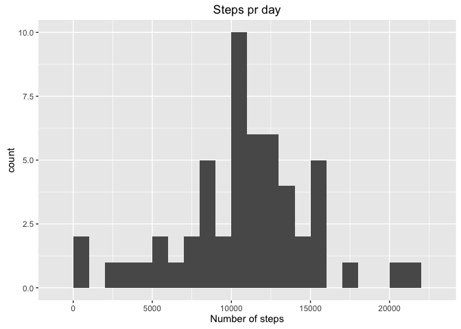
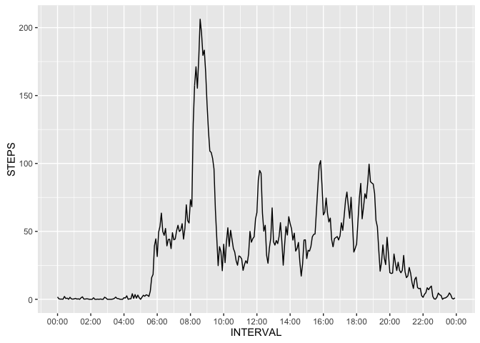
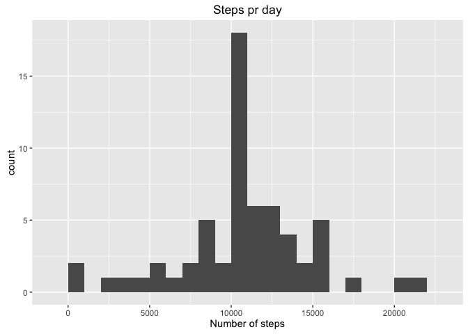
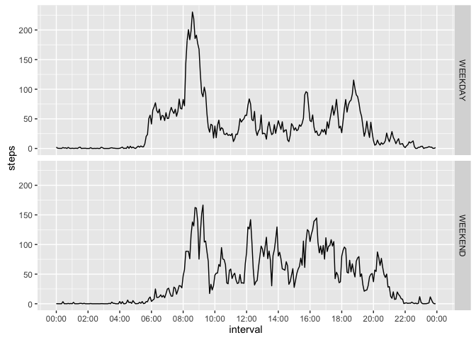

# Reproducible Research: Peer Assessment 1


## Loading and preprocessing the data

```r
df<-read.csv(unz("activity.zip","activity.csv"))
df$datetime<-paste(as.character(df$date),as.character(formatC(df$interval, width = 4, format = "d", flag = "0")),sep = ' ')
df$datetime<-strptime(df$datetime,format = "%Y-%m-%d %H%M")
```


## What is mean total number of steps taken per day?
#### Aggregating the data on date and calulating total number of steps:

```r
daygroup<-aggregate(df$steps, by=list(df$date), FUN=sum)
total_steps<-sum(unlist(daygroup[2]),na.rm = T)
total_steps
```

```
## [1] 570608
```
#### Histogram of steps pr day

```r
a<-ggplot(daygroup,aes(x))
a+geom_histogram(binwidth = 1000,na.rm = TRUE)+labs(title ="Steps pr day", x = "Number of steps", y = "count")
```




#### Mean and median number of steps pr day

the mean value is 10766.19 , and the median is 10765

## What is the average daily activity pattern?
#### Aggregating the data on the different time intervals:

```r
df_nona<-df[!is.na(df$steps),]
intervalgroup<-aggregate(df_nona$steps, by=list(as.factor(df_nona$interval)), FUN=mean)
names(intervalgroup)<-c("INTERVAL","STEPS")
intervalgroup$INTERVAL<-sprintf("%04s", as.character.factor(intervalgroup$INTERVAL))
intervalgroup$INTERVAL<-strptime(intervalgroup$INTERVAL,format="%H%M",tz = "GMT")
```

#### Plot of the average steps across the day

```r
b<-ggplot(intervalgroup,aes(INTERVAL,STEPS))
b+scale_x_datetime(date_breaks = "2 hours",date_labels = "%H:%M")+geom_line()
```



####The interval with the highest average number of steps

```r
strftime(intervalgroup[order(intervalgroup$STEPS,decreasing = TRUE),][1,1],format = "%H:%M")
```

```
## [1] "08:35"
```


## Imputing missing values

```r
#The total number of NA's in the data set is:
sum(is.na(df$steps))
```

```
## [1] 2304
```
#### adding missing values

```r
#a missing value is imputed as the mean of time interval
df_nona<-df[!is.na(df$steps),]
impute_data<-aggregate(df_nona$steps, by=list(as.factor(df_nona$interval)), FUN=mean)
impute_data$Group.1<-as.integer(as.character(impute_data$Group.1))
#Create a new dataset
df2<-df[,c(1:3)]
nan_index<-which(is.na(df2$steps)==TRUE)
for (nan_i in nan_index) {
    df2[nan_i,1]<-unlist(impute_data[impute_data$Group.1==df2[nan_i,3],][2])
}
daygroup2<-aggregate(df2$steps, by=list(df2$date), FUN=sum)
total_steps<-sum(unlist(daygroup2[2]),na.rm = T)
total_steps
```

```
## [1] 656737.5
```
#### Histogram of steps pr day with NA values imputed

```r
c<-ggplot(daygroup2,aes(x))
c+geom_histogram(binwidth = 1000,na.rm = TRUE)+labs(title ="Steps pr day", x = "Number of steps", y = "count")
```



the mean value is 10766.19, and the median is 10766.19
It seems that imputing the missing values as the mean of the interval doesn't affect the mean, but the median is now equal to mean.


## Are there differences in activity patterns between weekdays and weekends?
####adding weekdays to the dataset

```r
df2$datetime<-paste(as.character(df2$date),as.character(formatC(df2$interval, width = 4, format = "d", flag = "0")),sep = ' ')
df2$datetime<-strptime(df2$datetime,format = "%Y-%m-%d %H%M")
df2$weekday<-weekdays(df2$datetime)
df2$day_category<-ifelse(df2$weekday %in% c("Saturday","Sunday"),"WEEKEND","WEEKDAY")
df2$day_category<-as.factor(df2$day_category)
intervalgroup2<-aggregate(steps~interval + day_category, data = df2,FUN=mean)
intervalgroup2$interval<-sprintf("%04s", as.character(intervalgroup2$interval))
intervalgroup2$interval<-strptime(intervalgroup2$interval,format="%H%M",tz = "GMT")
```
####Differences in the activity in weekdays and weekends

```r
d<-ggplot(intervalgroup2,aes(interval,steps))
d+scale_x_datetime(date_breaks = "2 hours",date_labels = "%H:%M")+geom_line()+facet_grid(day_category~.)
```


